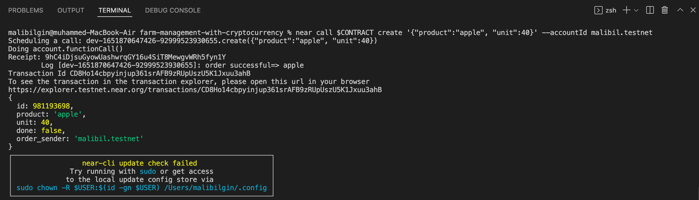
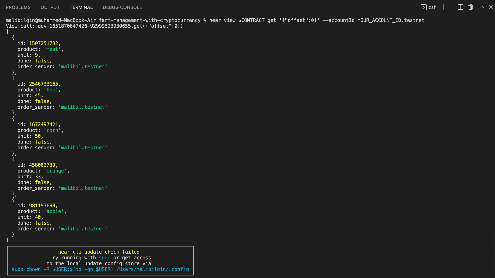
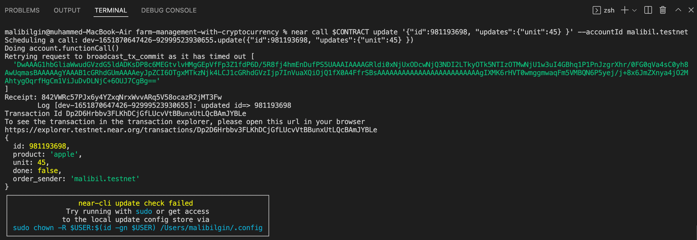
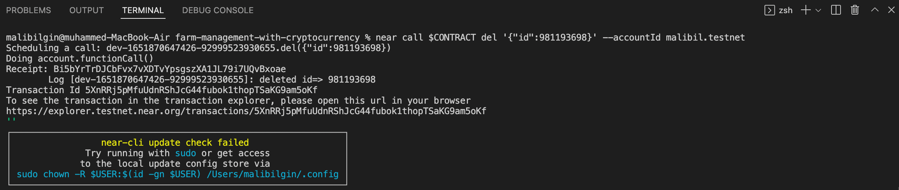

# farm-management-with-cryptocurrency

Trading the goods produced on the farm and needed by the farm with cryptocurrency. Our farm receives orders via cryptocurrency.

## Setup​ pre-requisites​:

1. npm
2. Near-cli
3. Make sure you have Node.js 14.16 installed, then use it to install yarn: npm install --global yarn (or just npm i -g yarn)

## Steps

    git clone https://github.com/muhammedalibilgin/farm-management-with-cryptocurrency.git
    cd farm-management-with-cryptocurrency
    yarn
    login near
    yarn build:release
    yarn deploy

    export CONTRACT=YOUR-CONTRACT-ID

---

> **loom video**

---

# Usage

> -   **create a new order**

For example creating an order of 40 apples.

    near call $CONTRACT create '{"product":"some_product", "unit":number}' --accountId YOUR_ACCOUNT_ID.testnet

> -   **view order list**

Let's view our apple order with the orders created for testing purposes before.

    near view $CONTRACT get '{"offset":0}' --accountId YOUR_ACCOUNT_ID.testnet

> -   **update order**

Let's update our apple order number from 40 to 45.

    near call $CONTRACT update '{"id":SOME_ID_HERE, "updates":{"unit":U32} }' --accountId YOUR_ACCOUNT_ID.testnet

> -   **delete order**

And finally we can delete the apple order we added.

    near call $CONTRACT del '{"id":SOME_ID_HERE }' --accountId YOUR_ACCOUNT_ID.testnet

---

<https://www.patika.dev/>
